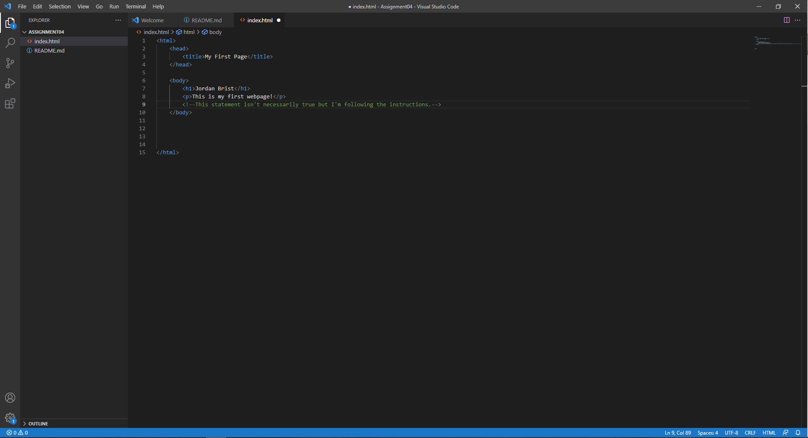

# Assignment 4
## Jordan Brist

1. A computer or network sends sends information to a server which returns the necessary HTML and CSS for displaying the page. The browser reads the code and renders it for the user. A browser uses a simple interface for interacting with websites. 
2. A markup language is a language that uses annotations or tags to define elements in a document, this allows documents and web-pages to display content in the correct style and formatting on any device. HTML is used in web development. 

