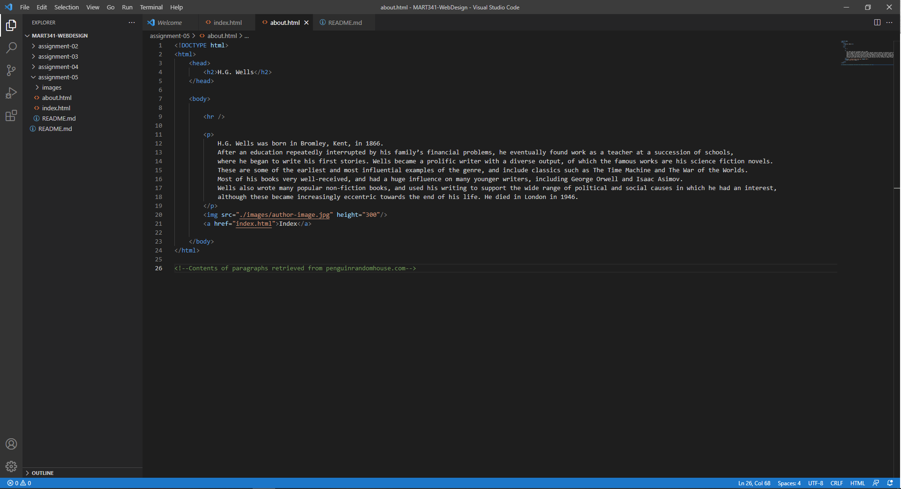

# Assignment 5
## Jordan Brist

1.  I visited a couple websites using the wayback machine. I looked at Amazon, eBay, and YouTube. It was surprising that they looked so foreign to me even though they were sites that I used to use on a regular basis back in 2010 and 2011. The layouts, icons, formatting, even the colors. Everything looks so different today. The best way to describe it would be comparing Times New Roman to Arial. They just look old, not **colorful-gif-explosion** old, but still old.
2. These last few assignments using html have pretty much been acting as a refresher for what I learned in MART 120 last semester, so it has been pretty straight-forward.

